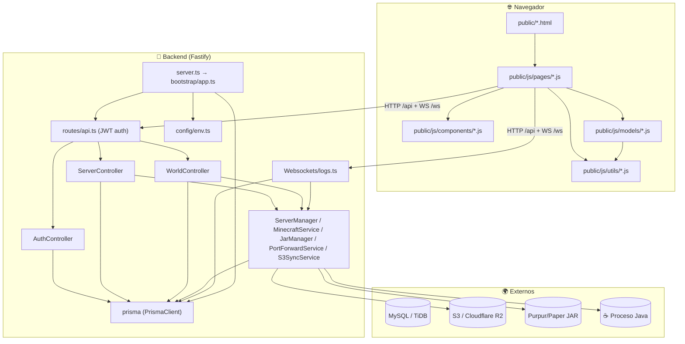
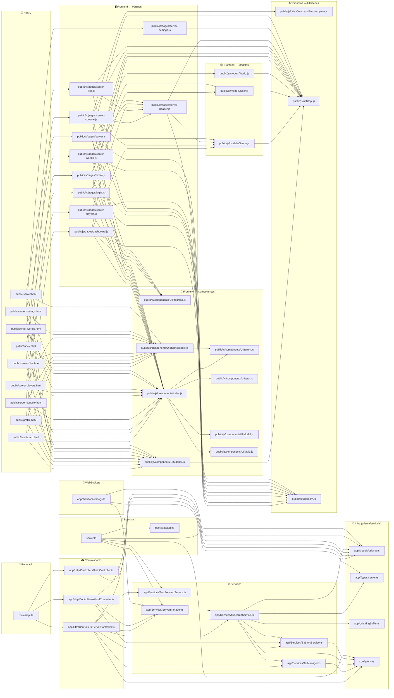

# 🗺️ Arquitectura — Minecraft Manager

> Documento vivo. El **grafo de dependencias** de abajo se regenera automáticamente con:
> ```bash
> node scripts/gen-arch-graph.mjs
> ```

## Vista de capas (alto nivel)



## Glosario de capas

| Capa | Dónde | Responsabilidad |
|---|---|---|
| **Bootstrap** | `server.ts`, `bootstrap/app.ts` | Levanta Fastify, registra rutas, restaura forwarders/adopción al arrancar |
| **Rutas API** | `routes/api.ts` | Prefijos `/auth`, `/server`, `/server/:id/worlds` + middleware JWT |
| **Controladores** | `app/Http/Controllers/` | Auth, Server, World — parsean requests, orquestan servicios |
| **WebSockets** | `app/Websockets/logs.ts` | Logs en vivo del servidor MC hacia el navegador |
| **Servicios** | `app/Services/` | `MinecraftService` (spawn/adopt/status), `JarManager` (descargas), `PortForwardService` (proxy TCP 80/443), `S3SyncService` (backups), `ServerManager` (registry) |
| **Infra** | `app/Models/prisma.ts`, `app/Utils/`, `app/Types/`, `config/env.ts` | Cliente Prisma, RingBuffer de logs, tipos compartidos, env |
| **Esquema** | `prisma/schema/*.prisma` | Modelos: User, Token, Server, World, ServerLog, MinecraftAccount |
| **Frontend** | `public/` | HTML por página + JS modular (pages → components/models/utils) |

## Rutas del servidor Minecraft

- **Consola/estado**: `MinecraftService` escribe en stdin de la JVM, lee stdout → `RingBuffer` → WebSocket.
- **Persistencia**: `S3SyncService` zip/upload del mundo al apagar → download/unzip al encender.
- **Exposición**: `PortForwardService` reenvía puerto público (80/443) al puerto interno, restaurado al arrancar el backend.
- **Personalización**: MOTD + `server-icon.png` se escriben en `server.properties` al iniciar.

## Grafo de dependencias (generado)

<!-- GRAPH:START -->



<!-- GRAPH:END -->

## Regenerar

```bash
node scripts/gen-arch-graph.mjs
```

Escanea `app/`, `routes/`, `public/` y `prisma/` por imports relativos y reemplaza el bloque entre los marcadores. Útil como **mapa mental** antes de tocar código: mirá el grafo y sabés qué toca cada módulo.
